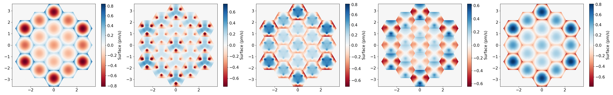

.. ultra_docs documentation master file, created by
   sphinx-quickstart on Thu Oct 19 16:24:04 2023.
   You can adapt this file completely to your liking, but it should at least
   contain the root `toctree` directive.

``ultra``: a python package for pm-level wavefront tolerance analysis for exo-earth imaging
============================================================================================
``ultra`` is a python package developed to estimate maximum allowable wavefront-error drifts for Earth-like
planet imaging with future space telescopes. The package comprises various analytical tools to simulate
wavefront error propagation through a coronagraphic system, calculate static tolerances using PASTIS algorithm
and dynamic tolerances with a close-loop recursive algorithm. The package supports wavefront-error budget analysis for
multiple segmented-primary mirror architectures with their optimized coronagraphic masks.

   Figure : Analysis results for a 19-segment
   `SCDA <https://exoplanets.nasa.gov/exep/technology/SCDA/>`_ telescope design.

The ``ultra`` package is developed by the ULTRA research team at
the `Space Telescope Science Institute <https://www.stsci.edu/>`_, and is privately hosted at
`github.com/spacetelescope/ULTRA <https://github.com/spacetelescope/ULTRA>`_ .

Getting started with ``ultra``
================================
To install and use the package users should read the instructions mentioned in the contents.

.. toctree::
   :maxdepth: 1
   :caption: Contents

   introduction.rst
   installation.rst
   workflow.rst

.. admonition:: How to cite ``ultra``

   Users are encouraged to cite one or more of the following references when using ``ultra`` package.

    * Coyle et al. 2023, "Continued maturation of enabling component-level technologies for large, segmented ultra-stable telescopes", Proc. SPIE. 12676

    * Sahoo et al. 2022, "Segment-level thermal sensitivity analysis for exo-Earth imaging.", Proc. SPIE. 12180

   If there is no appropriate place in the body of text to cite these references, please include something along the lines of the following in your acknowledgements: *"This research made use of ultra, a python package to compute pm-level wavefront error budget for exo-earth imaging."*
--------------------------------------------

Acknowledgements
================

- The ``ultra`` package is created in support of the Ultra-Stable Telescope Research and Analysis (ULTRA) Program under Contract No. 80MSFC20C0018 with the National Aeronautics and Space Administration (PI: Laura E. Coyle)

- The `Space Telescope Science Institute collaborators <https://www.stsci.edu/>`_, in particular the ULTRA team, Ball Aerospace and L3Harris Technologies.
